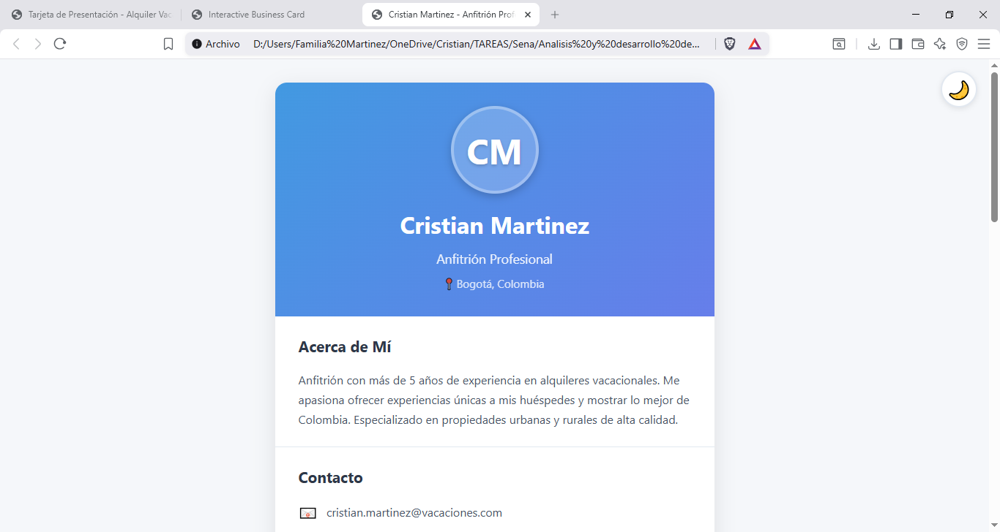
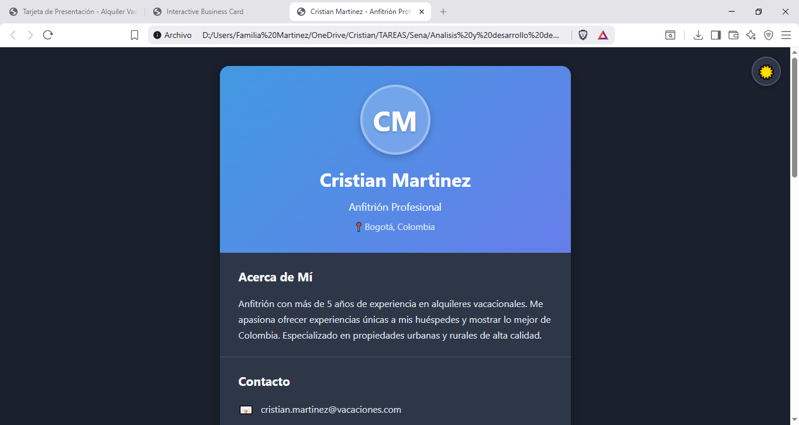

# Ficha de Alquiler Vacacional - Cristian Martinez

## 📋 Información
- **Nombre**: Cristian Martinez
- **Fecha**: 09/02/2026
- **Dominio Asignado**: Plataforma de Alquiler Vacacional
- **Entidad Principal**: Anfitrión Profesional de Propiedades Vacacionales

## 🎯 Descripción
Esta ficha interactiva presenta el perfil profesional de un anfitrión de alquileres vacacionales en Colombia. Muestra información detallada sobre el anfitrión, sus propiedades disponibles en diferentes ciudades colombianas (Bogotá, Medellín, Cartagena, Salento, Villa de Leyva), estadísticas de rendimiento, y enlaces a plataformas de reserva. La aplicación permite alternar entre tema claro y oscuro, copiar información al portapapeles, y mostrar/ocultar propiedades de forma dinámica.

## 📚 Conceptos ES2023 Aplicados
- [x] Variables con let/const
- [x] Template literals
- [x] Arrow functions
- [x] Destructuring
- [x] Optional chaining (?.)
- [x] Nullish coalescing (??)

## 🚀 Cómo Ejecutar
1. Abrir index.html en el navegador

## 📸 Screenshots

### Modo Claro

### Modo Oscuro

## 🎯 Autoevaluación
- Funcionalidad: 100%
- Código ES2023: 100%
- Código Limpio: 100%
- Adaptación al Dominio: 100%
- **Total Estimado**: 100%

## 🔍 Detalles de Implementación

### Funcionalidades Implementadas
- ✅ Información del anfitrión con avatar de iniciales
- ✅ 6 propiedades con barras de ocupación animadas
- ✅ Sistema de categorías (Urbano, Rural, Costero)
- ✅ Estadísticas calculadas dinámicamente
- ✅ Cambio de tema claro/oscuro con persistencia
- ✅ Copiar información al portapapeles
- ✅ Mostrar/ocultar propiedades (4 o 6)
- ✅ Sistema de notificaciones toast
- ✅ Enlaces a plataformas (Airbnb, Booking, Instagram, WhatsApp)
- ✅ Diseño responsive

### Datos del Dominio
**Propiedades:**
1. Apartamento Centro - Bogotá (95% ocupación)
2. Casa Cafetera - Salento, Quindío (88% ocupación)
3. Loft Moderno - Medellín (92% ocupación)
4. Villa Playa - Cartagena (97% ocupación)
5. Cabaña Montaña - Villa de Leyva (85% ocupación)
6. Penthouse Premium - Bogotá (98% ocupación)

**Estadísticas:**
- Total Propiedades: 6
- Total Reservaciones: 342
- Calificación: 4.9 ⭐
- Años de Experiencia: 5

### Métodos de Array Utilizados
- `map()` - Para renderizar listas de propiedades, enlaces y estadísticas
- `filter()` - Para filtrar propiedades por categoría
- `reduce()` - Para calcular ocupación promedio y capacidad total
- `slice()` - Para mostrar solo las primeras 4 propiedades
- `forEach()` - Para iterar sobre arrays en cálculos adicionales

